<div align="center">
  
  <h1>Pika Finance</h1>

  <p>
    <a href="https://wordpress.org/"></a>
    <a href="https://php.net/"></a>
    <a href="https://reactjs.org/"></a>
    <a href="https://www.typescriptlang.org/"></a>
    <a href="https://vitejs.dev/"></a>
    <a href="https://tailwindcss.com/"></a>
    <a href="https://www.gnu.org/licenses/gpl-2.0.html"></a>
    <a href="https://github.com/e-labInnovations/pika"></a>
  </p>

  <blockquote>
    A comprehensive financial management solution for WordPress that helps users track income, expenses, transfers, and manage their financial data with a modern PWA interface.
  </blockquote>
</div>

## 🌟 Features

- **📊 Financial Tracking**: Complete income, expense, and transfer management
- **🏦 Account Management**: Multiple accounts with balance tracking
- **👥 People Management**: Track transactions with contacts and people
- **🏷️ Categories & Tags**: Organize transactions with customizable categories and tags
- **📱 PWA Interface**: Modern Progressive Web App for mobile and desktop
- **📈 Analytics**: Monthly summaries, weekly expenses, and account balances
- **📎 File Attachments**: Upload receipts and documents
- **🤖 AI Features**: Gemini AI integration for smart financial insights

## 📸 Screenshots

<table>
  <tr>
    <td></td>
    <td>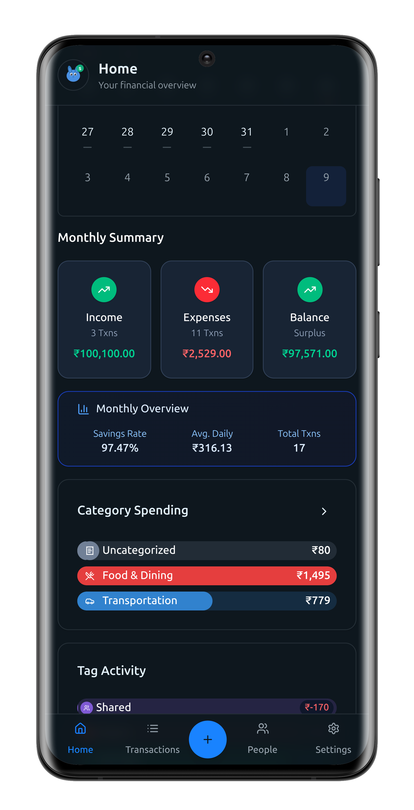</td>
    <td></td>
    <td>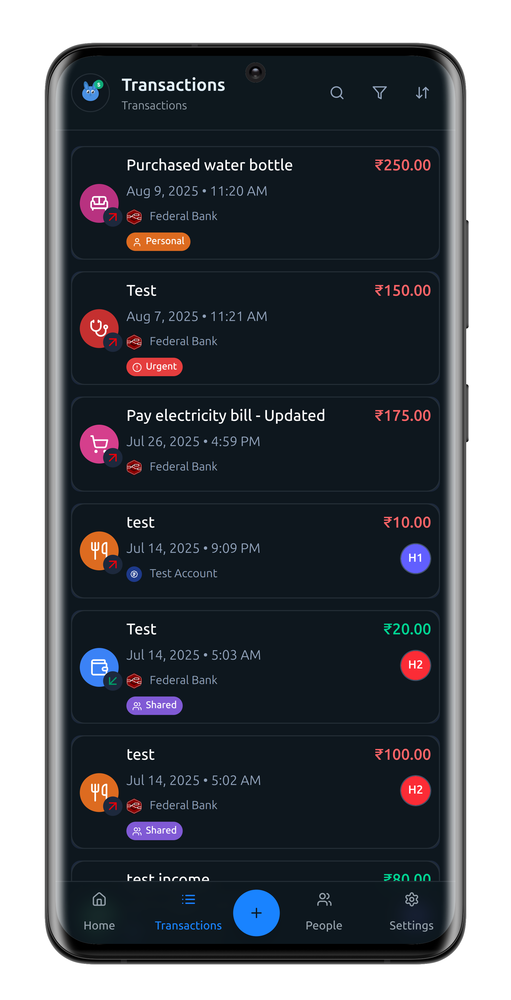</td>
  </tr>
  <tr>
    <td>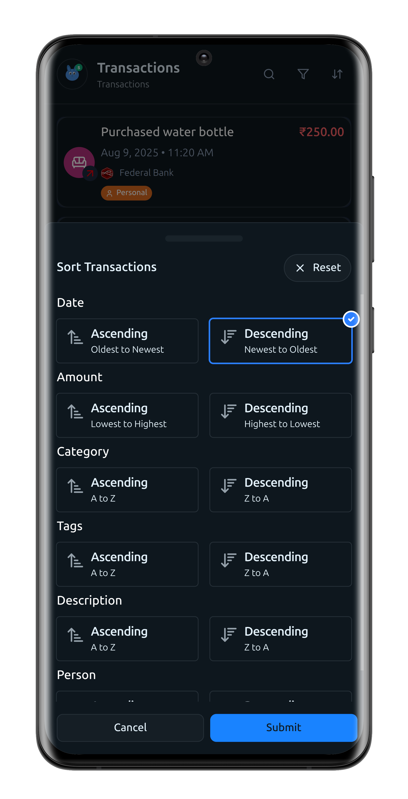</td>
    <td>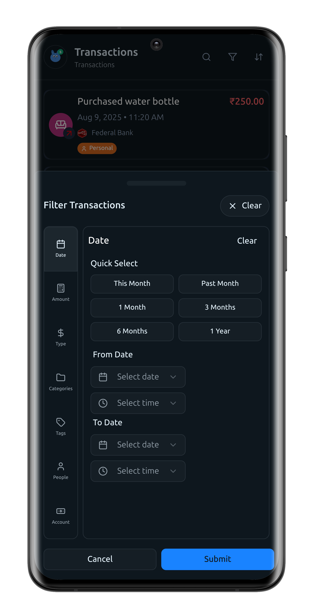</td>
    <td>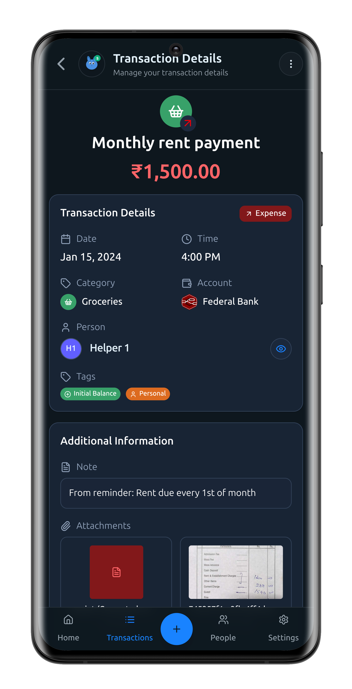</td>
    <td>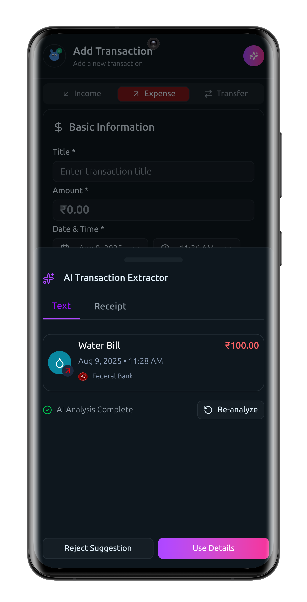</td>
  </tr>
  <tr>
    <td>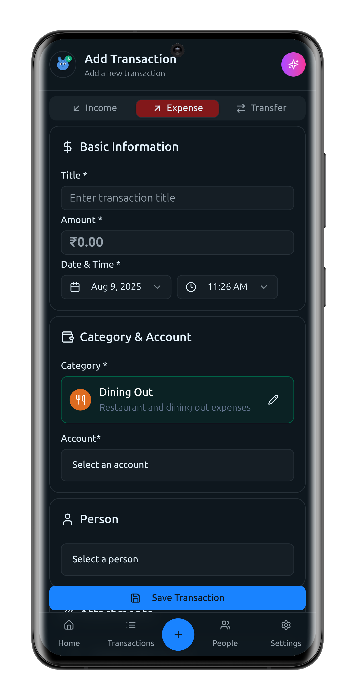</td>
    <td>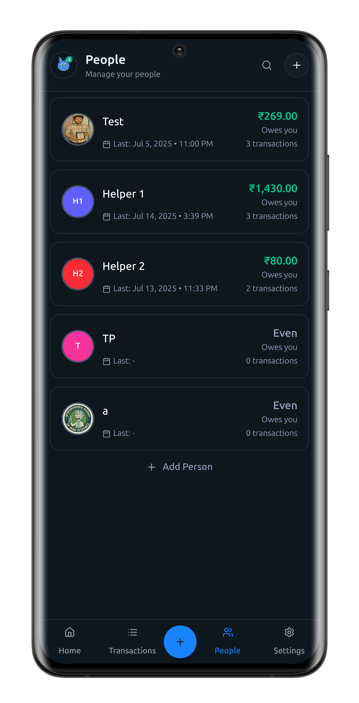</td>
    <td>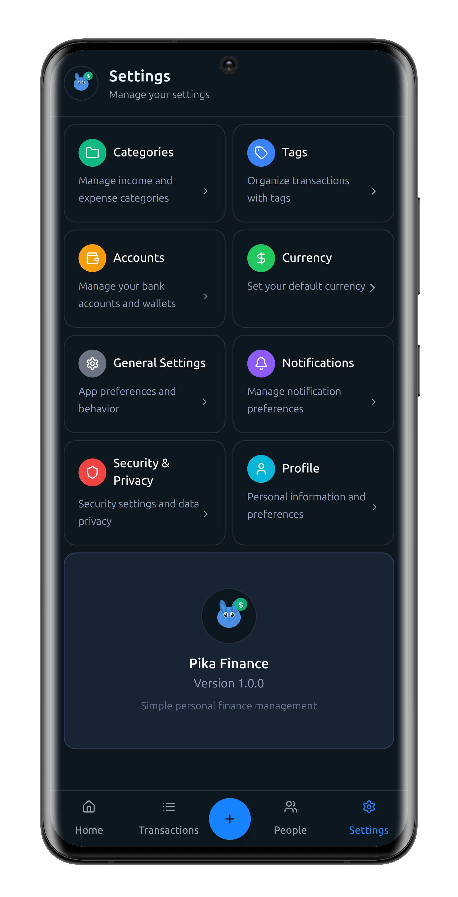</td>
    <td>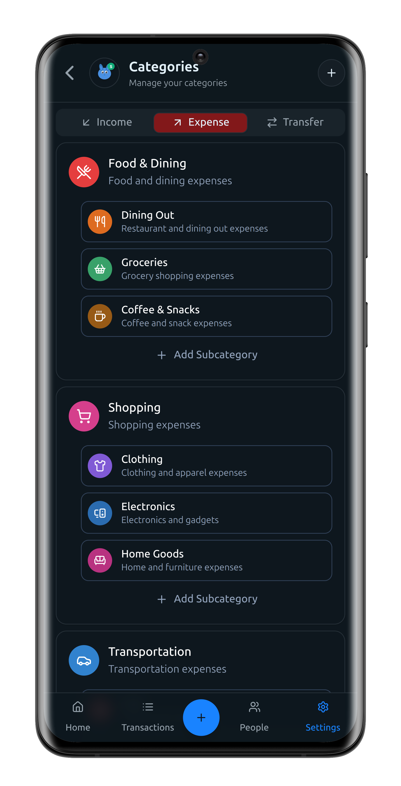</td>
  </tr>
  <tr>
    <td>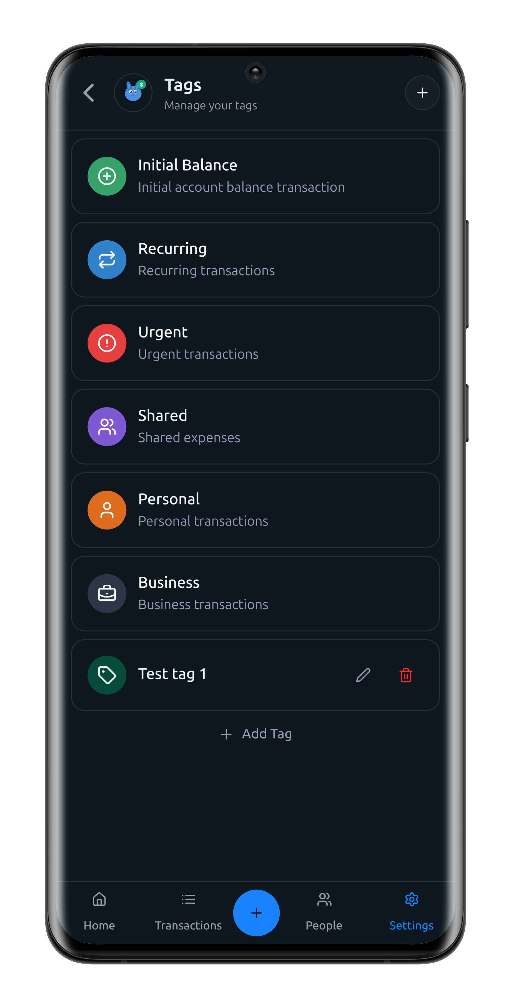</td>
    <td></td>
    <td>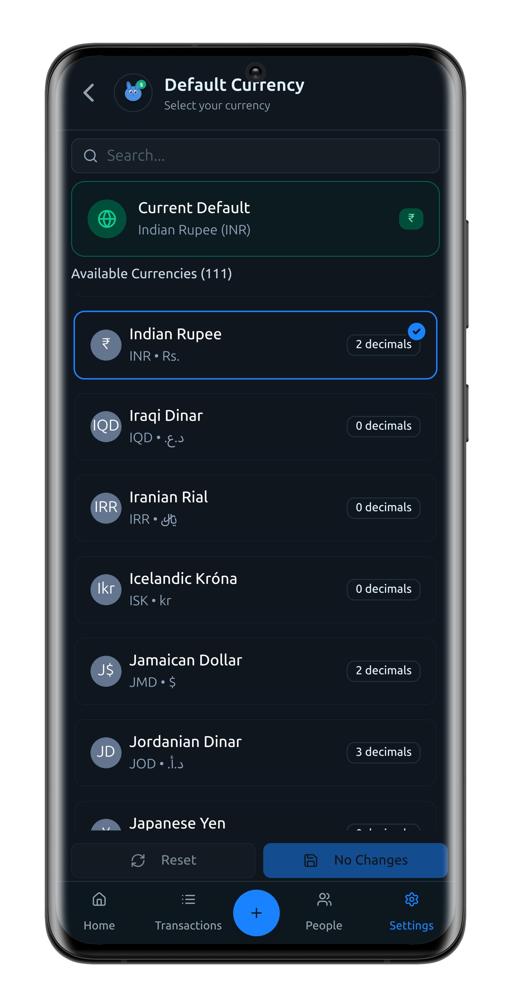</td>
    <td>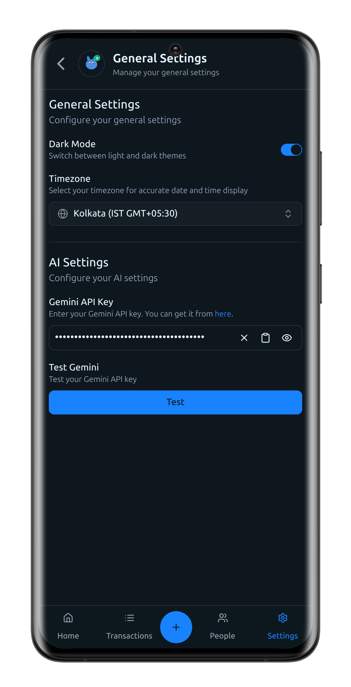</td>
  </tr>
</table>

## 📋 Requirements

- **WordPress**: 6.0 or higher
- **PHP**: 8.1 or higher
- **MySQL**: 5.6 or higher
- **Web Server**: Apache/Nginx with mod_rewrite enabled

## 🚀 Installation

### Method 1: WordPress Plugin Directory (Recommended)

1. **Search for Pika Finance** in the WordPress plugin section
   > _Note: Currently under development, not yet published_

### Method 2: Manual Installation

1. **Download the Plugin**

   - Download the latest version from the [releases page](https://github.com/e-labInnovations/pika/releases) as a ZIP file
   - Or clone the repository: `git clone https://github.com/e-labInnovations/pika.git`

2. **Install the Plugin**

   - Upload the ZIP file via WordPress Admin → Plugins → Add New → Upload Plugin
   - Or extract and copy the `pika` folder to `/wp-content/plugins/`

3. **Activate the Plugin**
   - Go to WordPress Admin → Plugins
   - Find "Pika Financial Management" and click "Activate"

### Access the Application

1. **Navigate to PWA**

   - Go to `yourdomain.com/pika` to access the PWA
   - If you get a 404 error, go to Settings → Permalinks and click "Save Changes" to update the routers

2. **Set Up Authentication**

   - All users need WordPress Application Passwords for login
   - Log in to your WordPress account
   - Go to Dashboard → Profile section
   - Generate an Application Password
   - Return to `/pika` and input your username and application password

3. **Configure AI Features (Optional)**
   - For AI features, go to [Google Gemini Studio](https://makersuite.google.com/app/apikey) and generate a free API key
   - Go to Pika General Settings and add your Gemini API key
   - _Note: WordPress-level key will be added soon; currently user-level keys are supported_

**🎉 You're now ready to use Pika!**

## 🏗️ Architecture

### WordPress REST API Integration

Pika follows WordPress best practices by extending `WP_REST_Controller` for all API endpoints:

- **🔧 Built-in Features**: Schema validation, pagination, response formatting
- **📚 Automatic Documentation**: WordPress generates API docs at `/wp-json/pika/v1/`
- **🛡️ Security**: WordPress authentication and permission handling
- **🔄 Consistency**: Standard HTTP methods and status codes

### Plugin Structure

```
pika/
├── pika.php                    # Main plugin file
├── uninstall.php               # Uninstall script
├── build.sh                    # Build script
├── backend/                    # Backend PHP files
│   ├── pika-loader.php         # Plugin loader
│   ├── activator.php           # Database setup
│   ├── deactivator.php         # Deactivation handler
│   ├── utils.php               # Utility functions
│   ├── api-loader.php          # REST API registration
│   ├── frontend-loader.php     # PWA frontend serving
│   ├── controllers/            # API controllers
│   ├── managers/               # Business logic managers
│   ├── admin/                  # Admin interface
│   └── data/                   # Data files
├── frontend/                   # React frontend (development)
│   ├── src/                    # Source code
│   ├── public/                 # Public assets
│   └── package.json            # Frontend dependencies
├── frontend-build/             # Built React app (production)
└── docs/                       # Documentation
```

## 🛠️ Development

### Prerequisites

- **WordPress**: Development environment
- **PHP**: 7.4+
- **MySQL**: 5.6+
- **Node.js**: 18+ (for frontend development)
- **Git**: For version control

### Backend Development

The backend is built with PHP following WordPress standards:

```bash
# Clone the repository
git clone https://github.com/e-labInnovations/pika.git
cd pika

# Set up WordPress locally (XAMPP, Local, etc.)
# Copy the plugin to /wp-content/plugins/
# Activate the plugin
```

**Key Backend Files:**

- `backend/controllers/` - REST API controllers
- `backend/managers/` - Business logic
- `backend/data/` - Data structures and AI prompts
- `backend/admin/` - WordPress admin interface

### Frontend Development

The frontend is built with React, TypeScript, and Vite:

```bash
# Navigate to frontend directory
cd frontend

# Install dependencies
npm install

# Start development server
npm run dev

# Build for production
npm run build
```

**Key Frontend Technologies:**

- **React 19.1.0** - UI framework
- **TypeScript 5.8.3** - Type safety
- **Vite 6.3.5** - Build tool
- **Tailwind CSS 4.1.8** - Styling
- **Radix UI** - Accessible components
- **TanStack Query** - Data fetching
- **Zustand** - State management
- **React Router** - Navigation

### Build Process

Use the provided build script to create production-ready packages:

```bash
# Make build script executable
chmod +x build.sh

# Run build
./build.sh
```

The build script will:

1. Build the frontend with Vite
2. Copy built files to `frontend-build/`
3. Create a ZIP file excluding development files
4. Clean up temporary files

### Database Schema

The plugin creates 8 custom tables:

- `wp_pika_accounts` - User accounts and balances
- `wp_pika_people` - Contacts and people management
- `wp_pika_categories` - Transaction categories (hierarchical)
- `wp_pika_tags` - Transaction tags
- `wp_pika_transactions` - Financial transactions
- `wp_pika_transaction_tags` - Transaction-tag relationships
- `wp_pika_transaction_attachments` - File attachments
- `wp_pika_user_settings` - User preferences

## 🔌 API Reference

### Base URL

```
/wp-json/pika/v1
```

### Core Endpoints

#### Authentication

- `GET /auth/me` - Get current user information

#### Financial Management

- `GET /accounts` - List user accounts
- `POST /accounts` - Create new account
- `GET /accounts/{id}` - Get account details
- `PUT /accounts/{id}` - Update account
- `DELETE /accounts/{id}` - Delete account

- `GET /transactions` - List transactions with filtering
- `POST /transactions` - Create new transaction
- `GET /transactions/{id}` - Get transaction details
- `PUT /transactions/{id}` - Update transaction
- `DELETE /transactions/{id}` - Delete transaction

- `GET /people` - List people/contacts
- `POST /people` - Create new person
- `GET /people/{id}` - Get person details
- `PUT /people/{id}` - Update person
- `DELETE /people/{id}` - Delete person

#### Categories & Tags

- `GET /categories` - List categories
- `POST /categories` - Create new category
- `GET /categories/{id}` - Get category details
- `PUT /categories/{id}` - Update category
- `DELETE /categories/{id}` - Delete category

- `GET /tags` - List tags
- `POST /tags` - Create new tag
- `GET /tags/{id}` - Get tag details
- `PUT /tags/{id}` - Update tag
- `DELETE /tags/{id}` - Delete tag

#### Analytics

- `GET /analytics/weekly-expenses` - Weekly expense breakdown
- `GET /analytics/monthly-summary` - Monthly financial summary
- `GET /analytics/daily-summaries` - Daily summaries for a month
- `GET /analytics/monthly-category-spending` - Category spending by month
- `GET /analytics/monthly-tag-activity` - Tag activity by month
- `GET /analytics/monthly-person-activity` - Person activity by month

#### Reminders

- `GET /reminders` - List all reminders
- `GET /reminders/due` - Get due reminders
- `GET /reminders/{id}` - Get reminder details
- `POST /reminders` - Create new reminder
- `PUT /reminders/{id}` - Update reminder
- `POST /reminders/{id}/archive` - Archive reminder
- `POST /reminders/{id}/complete` - Mark reminder as completed
- `POST /reminders/{id}/convert` - Convert reminder to transaction

#### AI Features

- `POST /ai/text-to-transaction` - Convert text to transaction
- `POST /ai/receipt-to-transaction` - Convert receipt image to transaction

#### Import/Export

- `GET /import-export/export` - Export user data
- `POST /import-export/import` - Import user data
- `GET /import-export/status` - Get import/export status
- `GET /import-export/formats` - Get available export formats

#### Settings & Upload

- `GET /settings` - Get user settings
- `PUT /settings` - Update user settings
- `POST /upload/{type}` - Upload files (avatars/attachments)

### Authentication

All endpoints require WordPress Application Passwords for authentication.

## 🧪 Testing

### Manual Testing Checklist

- [ ] Plugin activation and database setup
- [ ] Admin page access and functionality
- [ ] API endpoint registration
- [ ] Authentication endpoints
- [ ] CRUD operations for all entities
- [ ] File upload functionality
- [ ] PWA access and routing
- [ ] AI features with Gemini API
- [ ] Error handling and validation

### WordPress Debug Mode

Enable debug mode in `wp-config.php`:

```php
define('WP_DEBUG', true);
define('WP_DEBUG_LOG', true);
```

## 📦 Deployment

### Production Deployment

1. **Build Frontend**

   ```bash
   cd frontend
   npm run build
   ```

2. **Create Plugin Package**

   ```bash
   ./build.sh
   ```

3. **Upload Plugin**

   - Upload the generated ZIP file via WordPress Admin
   - Or extract and copy to `/wp-content/plugins/`
   - Activate the plugin

4. **Configure Server**
   - Ensure mod_rewrite is enabled
   - Set proper file permissions
   - Configure SSL for secure API access

## 🤝 Contributing

We welcome contributions! Please follow these guidelines:

1. **Fork the Repository**
2. **Create a Feature Branch**
   ```bash
   git checkout -b feature/amazing-feature
   ```
3. **Follow Coding Standards**
   - WordPress coding standards for PHP
   - ESLint configuration for JavaScript/TypeScript
   - Proper documentation
4. **Test Thoroughly**
   - Unit tests for new functionality
   - Manual testing on different environments
5. **Submit a Pull Request**

### Development Guidelines

- Follow WordPress coding standards for PHP
- Use TypeScript for frontend development
- Add proper error handling
- Include documentation for new features
- Test on multiple WordPress versions
- Ensure backward compatibility

## 📄 License

This project is licensed under the GPL v2 or later - see the [LICENSE](LICENSE) file for details.

## 🆘 Support

### Documentation

- [API Documentation](docs/API_DOCUMENTATION.md)
- [Backend Development](docs/BACKEND_README.md)
- [Development Status](docs/DEVELOPMENT_STATUS.md)
- [Settings API](docs/SETTINGS_API.md)

### Getting Help

- **Issues**: [GitHub Issues](https://github.com/e-labInnovations/pika/issues)
- **Discussions**: [GitHub Discussions](https://github.com/e-labInnovations/pika/discussions)
- **Email**: support@pika.elabins.com

## 📈 Roadmap

### Version 1.1 (Q2 2025)

- [ ] Advanced analytics and reporting
- [ ] Budget planning and tracking
- [ ] Export/import functionality
- [ ] Multi-currency support

### Version 1.2 (Q3 2025)

- [ ] Mobile app (React Native)
- [ ] Receipt scanning with AI
- [ ] Bank account integration
- [ ] Advanced filtering and search

### Version 2.0 (Q4 2025)

- [ ] Team/family accounts
- [ ] Advanced permissions
- [ ] API rate limiting
- [ ] Webhook support

---

**Made with ❤️ by the e-lab innovations**

[Website](https://elabins.com) • [Documentation](https://elabins.com) • [Support](https://elabins.com)
