<div align="center">
  
  <h1>Pika Finance</h1>

  <p>
    <a href="https://wordpress.org/"></a>
    <a href="https://php.net/"></a>
    <a href="https://reactjs.org/"></a>
    <a href="https://www.typescriptlang.org/"></a>
    <a href="https://vitejs.dev/"></a>
    <a href="https://tailwindcss.com/"></a>
    <a href="https://www.gnu.org/licenses/gpl-2.0.html"></a>
    <a href="https://github.com/e-labInnovations/pika"></a>
  </p>

  <blockquote>
    A comprehensive financial management solution for WordPress that helps users track income, expenses, transfers, and manage their financial data with a modern PWA interface.
  </blockquote>
</div>

## 🌟 Features

- **📊 Financial Tracking**: Complete income, expense, and transfer management
- **🏦 Account Management**: Multiple accounts with balance tracking
- **👥 People Management**: Track transactions with contacts and people
- **🏷️ Categories & Tags**: Organize transactions with customizable categories and tags
- **📱 PWA Interface**: Modern Progressive Web App for mobile and desktop
- **📈 Analytics**: Monthly summaries, weekly expenses, and account balances
- **📎 File Attachments**: Upload receipts and documents
- **🤖 AI Features**: Gemini AI integration for creating transactions

## 📸 Screenshots

<table>
  <tr>
    <td>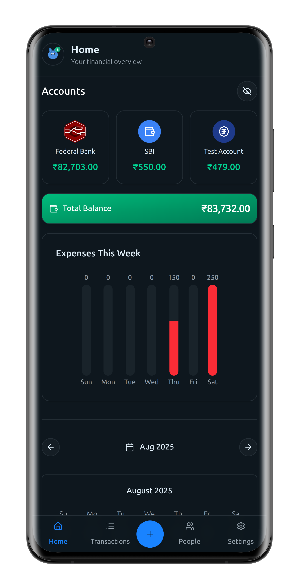</td>
    <td>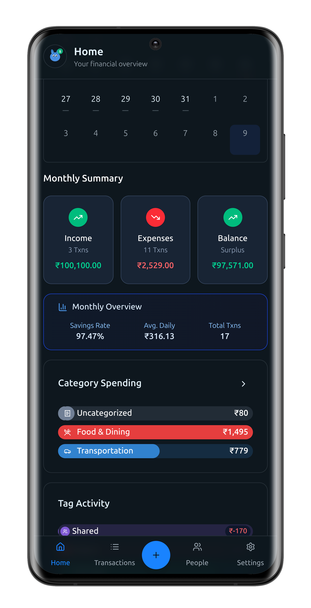</td>
    <td>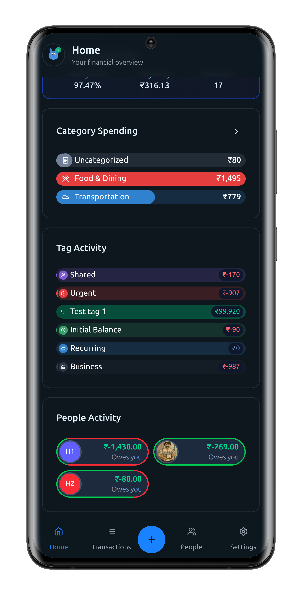</td>
    <td>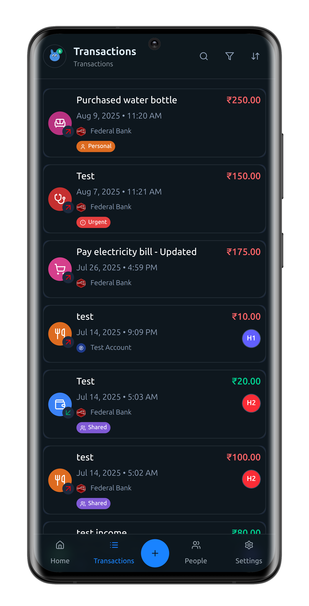</td>
  </tr>
  <tr>
    <td>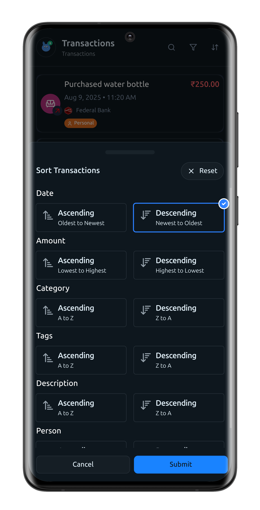</td>
    <td>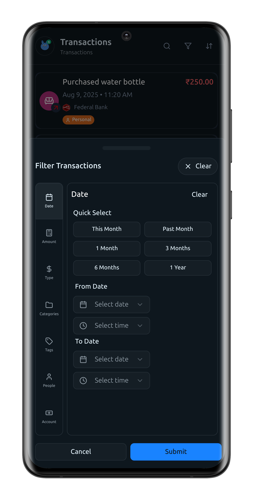</td>
    <td>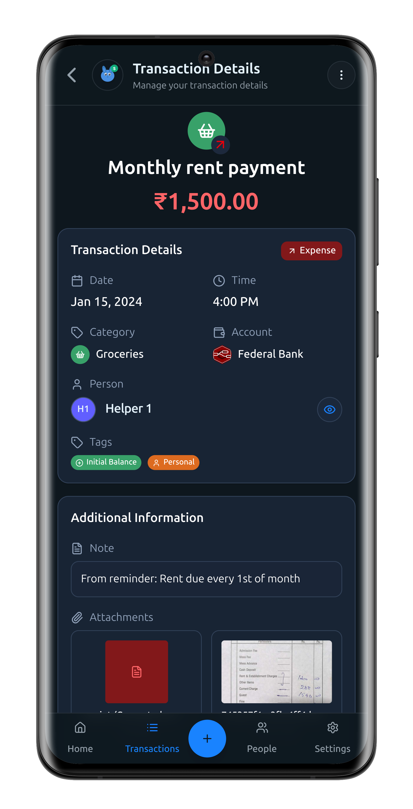</td>
    <td>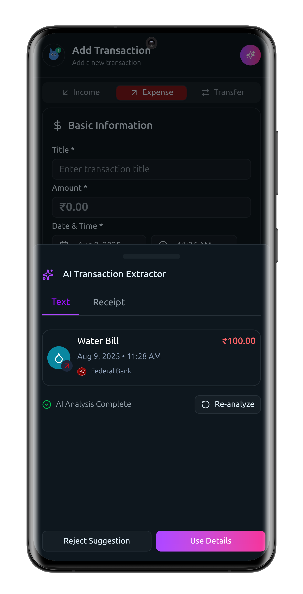</td>
  </tr>
  <tr>
    <td>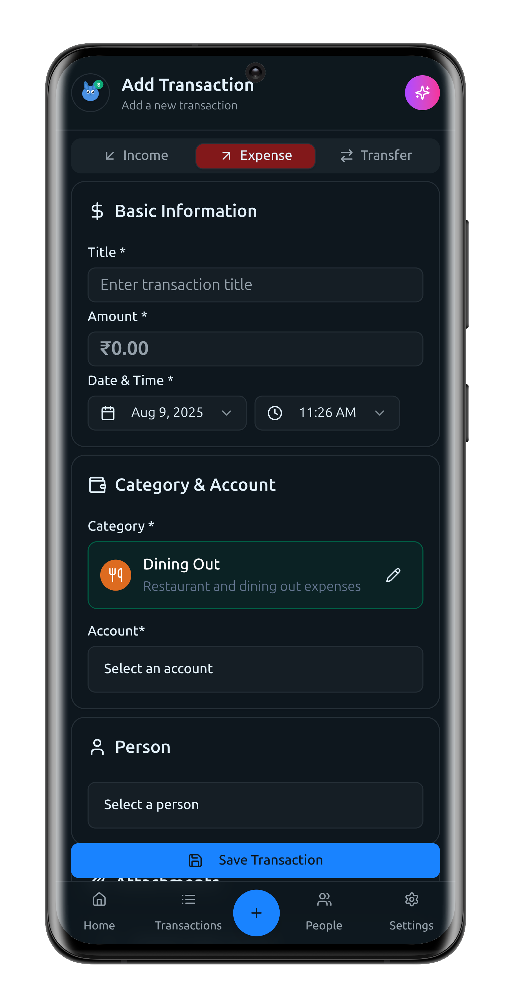</td>
    <td>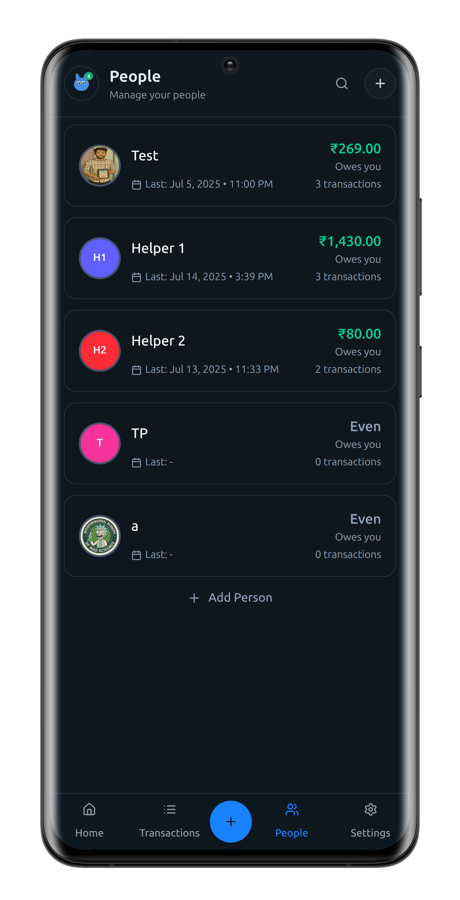</td>
    <td>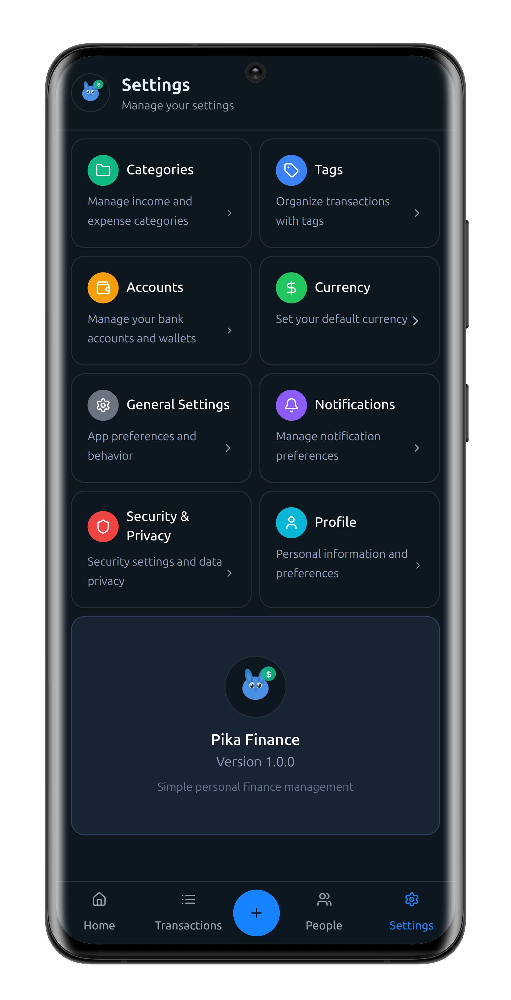</td>
    <td>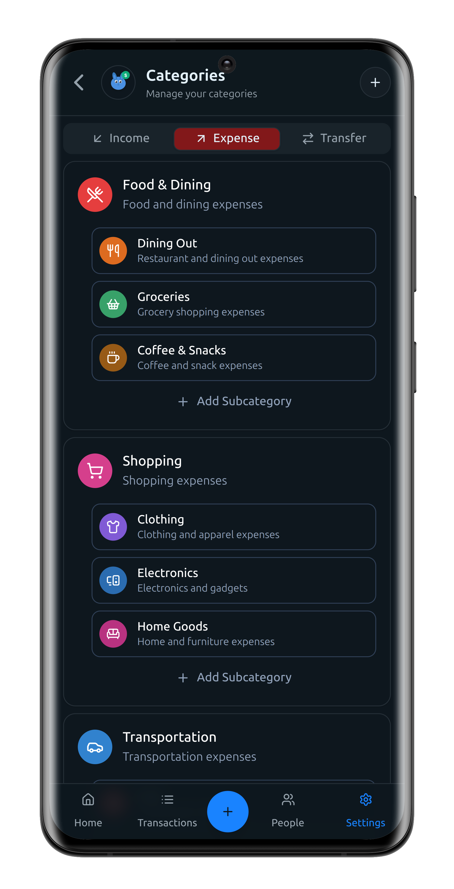</td>
  </tr>
  <tr>
    <td>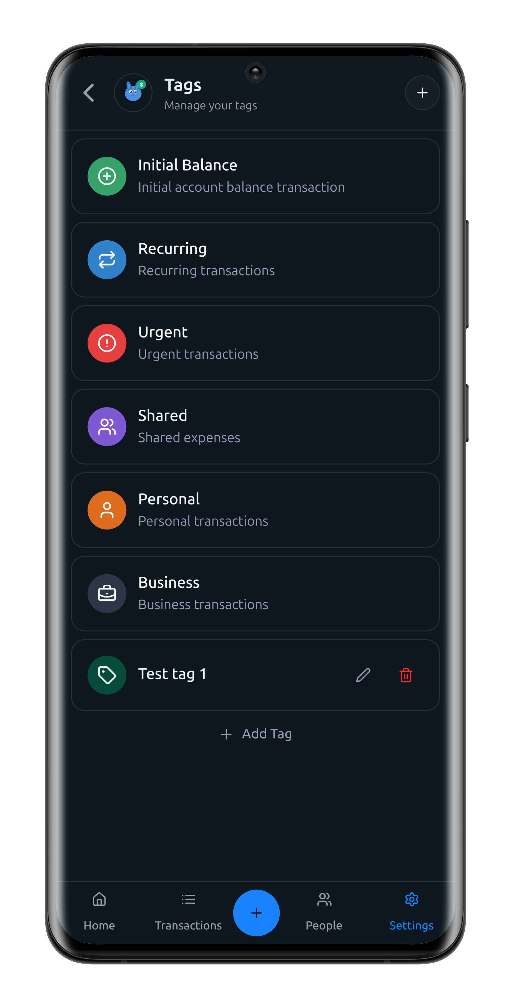</td>
    <td>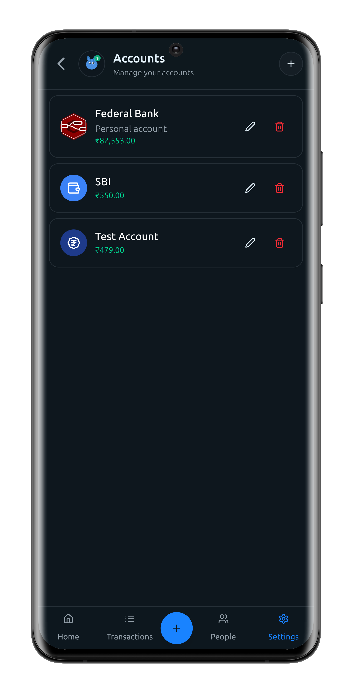</td>
    <td>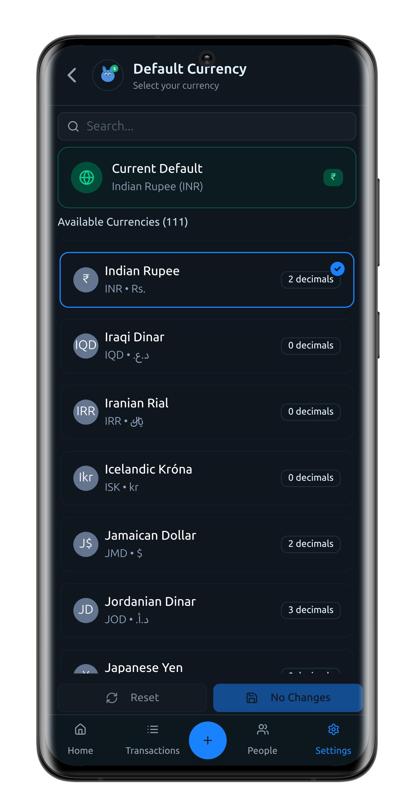</td>
    <td>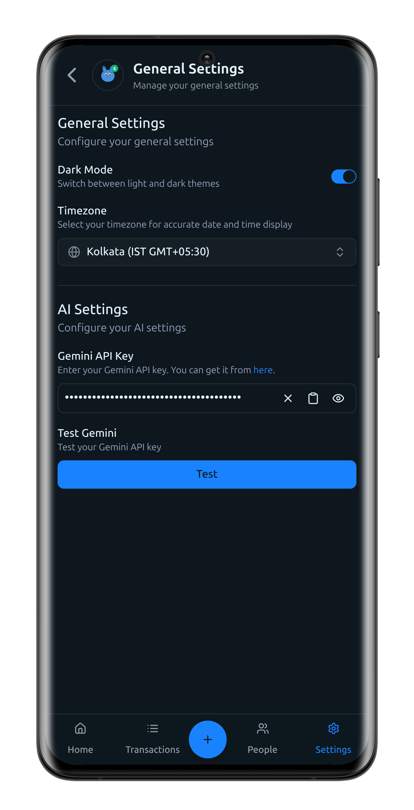</td>
  </tr>
</table>

## 🚀 Installation

### Method 1: WordPress Plugin Directory (Recommended)

1. **Search for Pika Finance** in the WordPress plugin section
   > _Note: Currently under development, not yet published_

### Method 2: Build from Source (Development)

1. **Clone the Repository**
   ```bash
   git clone https://github.com/e-labInnovations/pika.git
   cd pika
   ```

2. **Install Frontend Dependencies**
   ```bash
   cd frontend
   npm install
   ```

3. **Build the Plugin Package**
   ```bash
   # Return to project root
   cd ..
   
   # Make build script executable
   chmod +x build.sh
   
   # Run build to create plugin ZIP
   ./build.sh
   ```

4. **Install the Plugin**
   - Upload the generated ZIP file via WordPress Admin → Plugins → Add New → Upload Plugin
   - Or extract and copy the `pika` folder to `/wp-content/plugins/`

5. **Activate the Plugin**
   - Go to WordPress Admin → Plugins
   - Find "Pika Financial Management" and click "Activate"

### Method 3: Manual Installation (Legacy)

1. **Download the Plugin**

   - Download the latest version from the [releases page](https://github.com/e-labInnovations/pika/releases) as a ZIP file

2. **Install the Plugin**

   - Upload the ZIP file via WordPress Admin → Plugins → Add New → Upload Plugin
   - Or extract and copy the `pika` folder to `/wp-content/plugins/`

3. **Activate the Plugin**
   - Go to WordPress Admin → Plugins
   - Find "Pika Financial Management" and click "Activate"

### Access the Application

1. **Navigate to PWA**

   - Go to `yourdomain.com/pika` to access the PWA
   - If you get a 404 error, go to Settings → Permalinks and click "Save Changes" to update the routers

2. **Set Up Authentication**

   - On the login page, click the "Login" button.
   - You will be redirected to the WordPress login page.
   - After logging in, you will see an option to create an Application Password. You can leave the app name as it is, or edit it to something like "Pika Desktop" or "Pika Mobile App."
   - Click "Yes, I approve of this connection." You will then be redirected to the Pika app, where you can start using it.

3. **Configure AI Features (Optional)**
   - For AI features, go to [Google Gemini Studio](https://makersuite.google.com/app/apikey) and generate a free API key
   - Go to Pika General Settings and add your Gemini API key
   - _Note: WordPress-level key will be added soon; currently user-level keys are supported_

**🎉 You're now ready to use Pika!**

## 🔐 Authentication Flow

Pika uses a secure cookie-based authentication system that integrates seamlessly with WordPress Application Passwords. Here's how the authentication process works:

### Overview

The authentication flow ensures secure access to the PWA while leveraging WordPress's built-in security features. The system uses HTTP-only cookies to store authentication tokens, providing protection against XSS attacks.

### Step-by-Step Process

1. **Initial Login Request**
   - User visits the Pika login page (`/pika`)
   - Clicks the "Login" button which redirects to WordPress Application Password generation page

2. **Application Password Generation**
   - User is redirected to WordPress Admin → Profile → Application Passwords
   - Generates a new Application Password for Pika
   - WordPress redirects back to Pika authorization page with credentials

3. **Authorization Process**
   - Pika authorization page receives username and application password via URL parameters
   - Frontend calls `/wp-json/pika/v1/auth/login` endpoint with credentials
   - Backend validates credentials using `wp_authenticate_application_password()`

4. **Cookie Setting**
   - Upon successful authentication, backend creates a `pika_token` HTTP-only cookie
   - Token contains base64-encoded `username:application_password`
   - Cookie is set with secure flags: `httponly`, `secure`, `samesite=Strict`

5. **Middleware Authentication**
   - All subsequent API requests to `/wp-json/pika/v1/*` include the `pika_token` cookie
   - WordPress middleware intercepts requests via `determine_current_user` filter
   - Middleware decodes the cookie and authenticates using `wp_authenticate_application_password()`
   - Uses `application_password_is_api_request` filter to enable API authentication

6. **Logout Process**
   - User clicks logout in the PWA
   - Frontend calls `/wp-json/pika/v1/auth/logout` endpoint
   - Backend removes the `pika_token` cookie by setting expiration to a past time
   - **Additionally, the backend revokes the currently used WordPress Application Password, ensuring the token cannot be reused**
   - User is redirected to the login page

### Security Features

- **HTTP-Only Cookies**: Prevents JavaScript access to authentication tokens
- **Secure Flags**: Ensures cookies are only sent over HTTPS
- **SameSite Protection**: Prevents CSRF attacks
- **Application Passwords**: WordPress's secure authentication method
- **Middleware Validation**: Server-side authentication for all API requests
- **Token Revocation on Logout**: The currently used application password is revoked on logout, providing an extra layer of security

### Authentication Flow Diagram

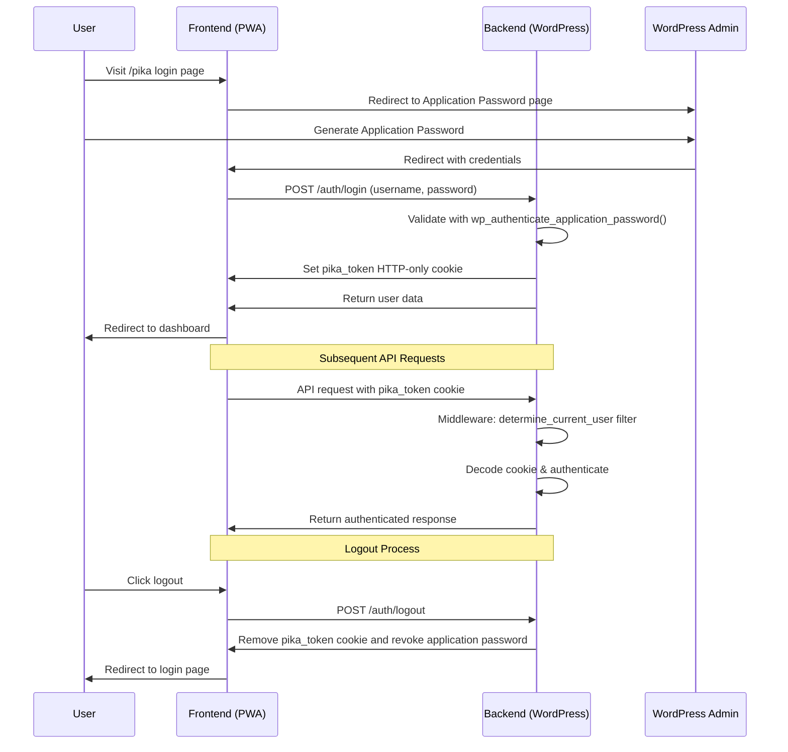

## 🏗️ Architecture

## 🛠️ Development

### Prerequisites

- **WordPress**: Development environment (use docker)
- **PHP**: 8.1+
- **MySQL**: 5.6+
- **Node.js**: 18+ (for frontend development)
- **Git**: For version control

### Backend Development

The backend is built with PHP, following WordPress standards:

**Key Backend Files:**

- `pika.php` – Main plugin file
- `backend/admin/` – WordPress admin interface
- `backend/ai/` – AI prompts and helper classes
- `backend/controllers/` – REST API controllers
- `backend/data/` – Data structures and AI prompts
- `backend/libraries/` – Composer-managed libraries
- `backend/managers/` – Business logic
- `backend-dev/` – React files for building the admin UI

The backend admin ui is built using react and ShadCn
```bash
# Install dependencies
npm install

# Start development
npm run start-dev

# Build for production
npm run build
```

### Frontend Development

The frontend is built with React, TypeScript, and Vite:

```bash
# Navigate to frontend directory
cd frontend

# Install dependencies
npm install

# Start development server
npm run dev

# Build for production
npm run build
```

**Key Frontend Technologies:**

- **React 19.1.0** - UI framework
- **TypeScript 5.8.3** - Type safety
- **Vite 6.3.5** - Build tool
- **Tailwind CSS 4.1.8** - Styling
- **ShadCn UI** - Accessible components
- **TanStack Query** - Data fetching
- **Zustand** - State management
- **React Router** - Navigation

### Build Process

Use the provided build script to create production-ready packages:

```bash
# Make build script executable
chmod +x build.sh

# Run build
./build.sh
```

The build script will:

1. Build the frontend with Vite
2. Copy built files to `frontend-build/`
3. Create a ZIP file excluding development files
4. Clean up temporary files

## 🧪 Testing

### WordPress Debug Mode

Enable debug mode in `wp-config.php`:

```php
define('WP_DEBUG', true);
define('WP_DEBUG_LOG', true);
```

## 📦 Deployment

### Production Deployment

1. **Create Plugin Package**

   ```bash
   ./build.sh
   ```

2. **Upload Plugin**

   - Upload the generated ZIP file via WordPress Admin
   - Or extract and copy to `/wp-content/plugins/`
   - Activate the plugin

3. **Configure Server**
   - Ensure mod_rewrite is enabled
   - Set proper file permissions
   - Configure SSL for secure API access

## 🤝 Contributing

We welcome contributions! Please follow these guidelines:

1. **Fork the Repository**
2. **Create a Feature Branch**
   ```bash
   git checkout -b feature/amazing-feature
   ```
3. **Follow Coding Standards**
   - WordPress coding standards for PHP
   - ESLint configuration for JavaScript/TypeScript
   - Proper documentation
4. **Test Thoroughly**
   - Unit tests for new functionality
   - Manual testing on different environments
5. **Submit a Pull Request**

### Development Guidelines

- Follow WordPress coding standards for PHP
- Use TypeScript for frontend development
- Add proper error handling
- Include documentation for new features
- Test on multiple WordPress versions
- Ensure backward compatibility

## 📄 License

This project is licensed under the GPL v2 or later - see the [LICENSE](LICENSE) file for details.

## 🆘 Support

### Documentation

- [API Documentation](docs/API_DOCUMENTATION.md)
- [Backend Development](docs/BACKEND_README.md)
- [Development Status](docs/DEVELOPMENT_STATUS.md)
- [Settings API](docs/SETTINGS_API.md)

### Getting Help

- **Issues**: [GitHub Issues](https://github.com/e-labInnovations/pika/issues)
- **Discussions**: [GitHub Discussions](https://github.com/e-labInnovations/pika/discussions)

---

**Made with ❤️ by the e-lab innovations**

[Website](https://elabins.com) • [Documentation](https://elabins.com) • [Support](https://elabins.com)
