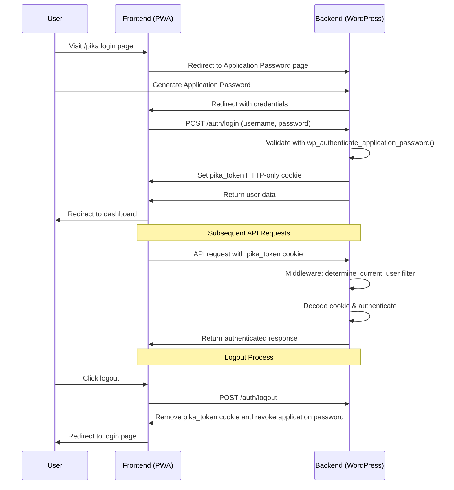

# 🔐 Authentication API

Pika uses WordPress Application Passwords for secure authentication. This system provides secure, token-based access without storing your main WordPress password.

## 🔑 Overview

The authentication system works as follows:
1. **Login**: Authenticate with username and application password
2. **Cookie-based Session**: Receive a secure HTTP-only cookie that have life of one year
3. **API Access**: Use the cookie for all subsequent API requests
4. **Logout**: Revoke the session and clear the cookie

## 📡 Base URL

All authentication endpoints are prefixed with:
```
/wp-json/pika/v1/auth/
```

## 🚀 Endpoints

### Login

Authenticate a user and create a session.

**Endpoint:** `POST /wp-json/pika/v1/auth/login`

**Request Body:**
```json
{
  "user_login": "username",
  "password": "application_password"
}
```

**Parameters:**
- `user_login` (string, required): WordPress username
- `password` (string, required): WordPress Application Password

**Response:**
```json
{
    "id": 2,
    "username": "testuser",
    "email": "ashad@elabins.com",
    "display_name": "Mohammed Ashad MM",
    "avatar_url": "https:\/\/secure.gravatar.com\/avatar\/e229a90a0d0547fd71c145a2515aab0793e9f217a5a90948b514d84272a778b1?s=96&d=mm&r=g",
    "settings": {
        "currency": "INR",
        "is_api_key_set": true
    }
}
```

**Example Request:**
```bash
curl -X POST http://localhost:8000/wp-json/pika/v1/auth/login \
  -H "Content-Type: application/json" \
  -d '{
    "user_login": "testuser",
    "password": "EEmc PH8u kgc4 3WY6 vFY9 y8Zp"
  }'
```

### Get Current User

Retrieve the current authenticated user's profile.

**Endpoint:** `GET /wp-json/pika/v1/auth/me`

**Headers:**
- `Cookie`: Authentication cookie from login

**Response:**
```json
{
    "id": 2,
    "username": "testuser",
    "email": "ashad@elabins.com",
    "display_name": "Mohammed Ashad MM",
    "avatar_url": "https:\/\/secure.gravatar.com\/avatar\/e229a90a0d0547fd71c145a2515aab0793e9f217a5a90948b514d84272a778b1?s=96&d=mm&r=g",
    "settings": {
        "currency": "INR",
        "is_api_key_set": true
    }
}
```

**Example Request:**
```bash
curl -X GET http://localhost:8000/wp-json/pika/v1/auth/me \
  -H "Cookie: pika_token=token"
```

### Get All Sessions

Retrieve all active sessions for the current user.

**Endpoint:** `GET /wp-json/pika/v1/auth/sessions`

**Headers:**
- `Cookie`: Authentication cookie

**Response:**
```json
[
    {
        "uuid": "d4513e1b-0a1c-49a0-8f72-e29bfb6e0693",
        "app_id": "562f6819-9357-454d-a82b-23a45137a3cd",
        "name": "Pika Finance",
        "created": "2025-08-23T16:05:56Z",
        "last_used": "2025-08-29T07:20:58Z",
        "last_ip": "172.22.0.1",
        "is_currently_using": true,
        "device_info": {
            "device_type": "smartphone",
            "brand": "Samsung",
            "model": "Galaxy S20 5G",
            "client_type": "browser",
            "client_name": "Chrome Mobile",
            "os_name": "Android"
        }
    },
    {
        "uuid": "5667d6ca-cd77-4b58-aaf9-4ad21f30bc68",
        "app_id": "562f6819-9357-454d-a82b-23a45137a3cd",
        "name": "Pika Finance",
        "created": "2025-08-29T15:22:44Z",
        "last_used": "2025-08-29T15:22:45Z",
        "last_ip": "172.22.0.1",
        "is_currently_using": false,
        "device_info": {
            "device_type": "desktop",
            "brand": "Apple",
            "model": "",
            "client_type": "browser",
            "client_name": "Chrome",
            "os_name": "Mac"
        }
    }
]
```

### Revoke Session

Revoke a specific session by its ID.

**Endpoint:** `POST /wp-json/pika/v1/auth/sessions/revoke`

**Headers:**
- `Cookie`: Authentication cookie
- `Content-Type: application/json`

**Request Body:**
```json
{"uuid":"session-uuid"}
```

**Response:**
```json
{"message":"Session revoked successfully"}
```

**Example Request:**
```bash
curl -X POST http://localhost:8000/wp-json/pika/v1/auth/sessions/revoke \
  -H "Cookie: pika_token=token" \
  -H "Content-Type: application/json" \
  -d '{"uuid":"session-uuid"}'
```

### Logout

Logout the current user and revoke the session.

**Endpoint:** `POST /wp-json/pika/v1/auth/logout`

**Headers:**
- `Cookie`: Authentication cookie

**Response:**
```json
{"message":"Logged out successfully"}
```

**Example Request:**
```bash
curl -X POST http://localhost:8000/wp-json/pika/v1/auth/logout \
  -H "Cookie: pika_token=token"
```

## 🔒 Security Features

### HTTP-Only Cookies
- Authentication tokens are stored in HTTP-only cookies and have a life of 1 year
- Prevents JavaScript access to authentication data
- Protection against XSS attacks

### Secure Flags
- Cookies are marked as secure (HTTPS only)
- SameSite protection prevents CSRF attacks

### Application Passwords
- WordPress Application Passwords are used instead of main passwords
- Each application gets a unique, revocable password
- Passwords are automatically revoked on logout

## 🚨 Error Responses

### Invalid UUID

This error is returned when a provided identifier is not a valid **Universally Unique Identifier (UUID)**. A UUID has a specific format (e.g., `123e4567-e89b-12d3-a456-426614174000`) that must be followed.

```json
{
  "code": "invalid_uuid",
  "message": "Invalid UUID",
  "data": {
    "status": 400
  }
}
```

### Session Not Found

This error indicates that the session associated with the user's request has **expired**, is **invalid**, or **does not exist**. This often requires the user to log in again. 🔑

```json
{
  "code": "session_not_found",
  "message": "Session not found",
  "data": {
    "status": 404
  }
}
```

## 🔄 Authentication Flow



## 📚 Related Documentation

- [Settings API](./settings) - Configure user preferences