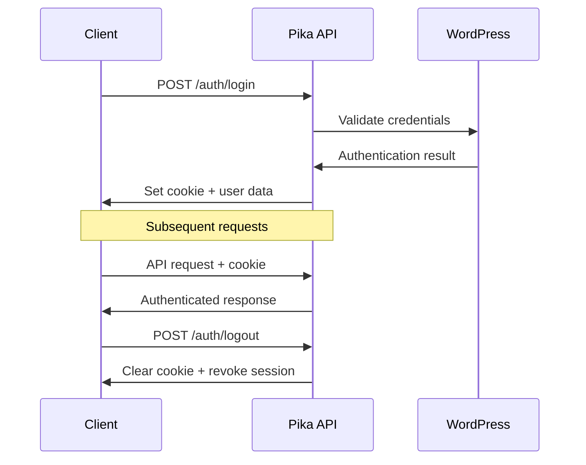

# 🔐 Authentication API

Pika uses WordPress Application Passwords for secure authentication. This system provides secure, token-based access without storing your main WordPress password.

## 🔑 Overview

The authentication system works as follows:
1. **Login**: Authenticate with username and application password
2. **Cookie-based Session**: Receive a secure HTTP-only cookie
3. **API Access**: Use the cookie for all subsequent API requests
4. **Logout**: Revoke the session and clear the cookie

## 📡 Base URL

All authentication endpoints are prefixed with:
```
/wp-json/pika/v1/auth/
```

## 🚀 Endpoints

### Login

Authenticate a user and create a session.

**Endpoint:** `POST /wp-json/pika/v1/auth/login`

**Request Body:**
```json
{
  "user_login": "username",
  "password": "application_password"
}
```

**Parameters:**
- `user_login` (string, required): WordPress username
- `password` (string, required): WordPress Application Password

**Response:**
```json
{
  "success": true,
  "data": {
    "user": {
      "ID": 1,
      "user_login": "testuser",
      "user_email": "test@example.com",
      "display_name": "Test User",
      "roles": ["subscriber"]
    },
    "session_id": "uuid-here"
  }
}
```

**Example Request:**
```bash
curl -X POST http://localhost:8000/wp-json/pika/v1/auth/login \
  -H "Content-Type: application/json" \
  -d '{
    "user_login": "testuser",
    "password": "EEmc PH8u kgc4 3WY6 vFY9 y8Zp"
  }'
```

### Get Current User

Retrieve the current authenticated user's profile.

**Endpoint:** `GET /wp-json/pika/v1/auth/me`

**Headers:**
- `Cookie`: Authentication cookie from login

**Response:**
```json
{
  "success": true,
  "data": {
    "user": {
      "ID": 1,
      "user_login": "testuser",
      "user_email": "test@example.com",
      "display_name": "Test User",
      "roles": ["subscriber"],
      "pika_profile": {
        "currency": "USD",
        "timezone": "UTC",
        "date_format": "Y-m-d"
      }
    }
  }
}
```

**Example Request:**
```bash
curl -X GET http://localhost:8000/wp-json/pika/v1/auth/me \
  -H "Cookie: pika_token=base64_encoded_token"
```

### Get All Sessions

Retrieve all active sessions for the current user.

**Endpoint:** `GET /wp-json/pika/v1/auth/sessions`

**Headers:**
- `Cookie`: Authentication cookie

**Response:**
```json
{
  "success": true,
  "data": {
    "sessions": [
      {
        "session_id": "uuid-1",
        "created_at": "2024-01-01T10:00:00Z",
        "last_used": "2024-01-01T15:30:00Z",
        "user_agent": "Mozilla/5.0...",
        "ip_address": "192.168.1.1"
      },
      {
        "session_id": "uuid-2",
        "created_at": "2024-01-01T12:00:00Z",
        "last_used": "2024-01-01T14:20:00Z",
        "user_agent": "Pika Mobile App",
        "ip_address": "192.168.1.2"
      }
    ]
  }
}
```

### Revoke Session

Revoke a specific session by its ID.

**Endpoint:** `POST /wp-json/pika/v1/auth/sessions/revoke`

**Headers:**
- `Cookie`: Authentication cookie
- `Content-Type: application/json`

**Request Body:**
```json
{
  "session_id": "uuid-here"
}
```

**Response:**
```json
{
  "success": true,
  "message": "Session revoked successfully"
}
```

**Example Request:**
```bash
curl -X POST http://localhost:8000/wp-json/pika/v1/auth/sessions/revoke \
  -H "Cookie: pika_token=base64_encoded_token" \
  -H "Content-Type: application/json" \
  -d '{
    "session_id": "uuid-here"
  }'
```

### Logout

Logout the current user and revoke the session.

**Endpoint:** `POST /wp-json/pika/v1/auth/logout`

**Headers:**
- `Cookie`: Authentication cookie

**Response:**
```json
{
  "success": true,
  "message": "Logged out successfully"
}
```

**Example Request:**
```bash
curl -X POST http://localhost:8000/wp-json/pika/v1/auth/logout \
  -H "Cookie: pika_token=base64_encoded_token"
```

## 🔒 Security Features

### HTTP-Only Cookies
- Authentication tokens are stored in HTTP-only cookies
- Prevents JavaScript access to authentication data
- Protection against XSS attacks

### Secure Flags
- Cookies are marked as secure (HTTPS only)
- SameSite protection prevents CSRF attacks

### Application Passwords
- WordPress Application Passwords are used instead of main passwords
- Each application gets a unique, revocable password
- Passwords are automatically revoked on logout

## 🚨 Error Responses

### Invalid Credentials
```json
{
  "success": false,
  "error": "Invalid credentials",
  "code": "invalid_credentials"
}
```

### Missing Authentication
```json
{
  "success": false,
  "error": "Authentication required",
  "code": "authentication_required"
}
```

### Session Expired
```json
{
  "success": false,
  "error": "Session expired",
  "code": "session_expired"
}
```

### Invalid Session
```json
{
  "success": false,
  "error": "Invalid session",
  "code": "invalid_session"
}
```

## 📱 WordPress Integration

### Creating Application Passwords

1. **Go to WordPress Admin → Users → Profile**
2. **Scroll to "Application Passwords" section**
3. **Enter app name (e.g., "Pika Mobile App")**
4. **Click "Add New Application Password"**
5. **Copy the generated password**

### Managing Passwords

- View all application passwords in your profile
- Revoke passwords individually
- Monitor password usage and creation dates

## 🔄 Authentication Flow



## 💡 Best Practices

1. **Store Application Passwords Securely**
   - Never commit passwords to version control
   - Use environment variables for production

2. **Handle Token Expiration**
   - Implement automatic logout on 401 responses
   - Redirect to login page when authentication fails

3. **Session Management**
   - Allow users to view active sessions
   - Provide option to revoke suspicious sessions

4. **Error Handling**
   - Implement proper error handling for auth failures
   - Show user-friendly error messages

## 📚 Related Documentation

- [Settings API](./settings) - Configure user preferences